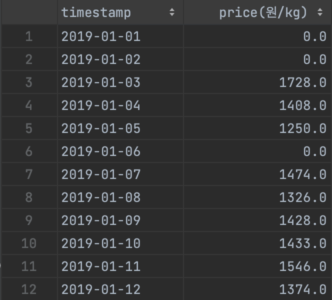
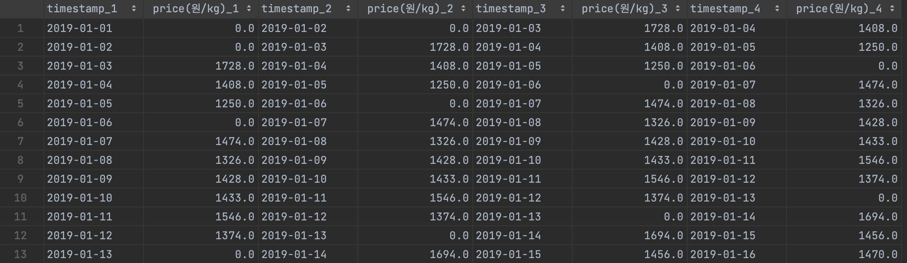

# 원하는 window수만큼 데이터 shift하기

## 기존


## 변환


```python
import pandas as pd


def set_window(df, window):

    row = len(df)
    index_num = []
    for i in range(0, row - (window - 1)):
        index_num.append(i)

    df_list = []
    for i in range(window):
        d1 = df.iloc[i:]
        for j in range(window - (i + 1)):
            d1 = d1.drop(d1.index[-1])
        d1.index = index_num
        df_list.append(d1)

    df_renamed_list = []
    for i, d1 in enumerate(df_list):
        d1 = add_postfix(d1, "_{}".format(i + 1))
        df_renamed_list.append(d1)

    result = pd.concat(df_renamed_list, axis=1)

    return result


def add_postfix(df, postfix):
    df = df.copy()
    for column_name in df.columns:
        df.rename(columns={column_name: column_name + postfix}, inplace=True)
    return df


df = pd.read_csv(filename='file.csv')
df_window = set_window(df, window=4)
```
