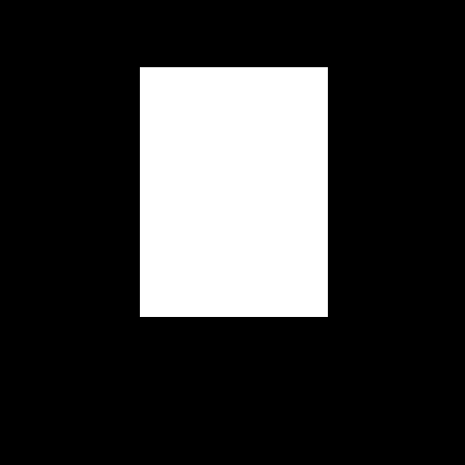

# GroundingDINO에서 바운딩 박스를 하얀색으로, 배경을 검은색으로 채워 마스킹하기

GroundingDINO/util/inference.py에서 annotate함수에 대해 아래와 같이 변경해주면 된다.

- cv2.rectangle(img, start, end, color, thickness)
  - img: 그림을 그릴 이미지
  - start: 시작 좌표
  - end: 종료 좌표
  - color: BGR형태의 Color
  - thickness (int): 선의 두께 pixel

## 기존


```python
def annotate(image_source: np.ndarray, boxes: torch.Tensor) -> np.ndarray:
    h, w, _ = image_source.shape
    boxes = boxes * torch.Tensor([w, h, w, h])
    xyxy = box_convert(boxes=boxes, in_fmt="cxcywh", out_fmt="xyxy").numpy()

    annotated_frame = cv2.cvtColor(image_source, cv2.COLOR_RGB2BGR)
    for box in xyxy:
        box = box.astype(int)
        cv2.rectangle(annotated_frame, (box[0], box[1]), (box[2], box[3]), (0, 255, 0), 2)

    return annotated_frame
```

## 변경


- ```np.zeros_like()```로 이미지를 검게 만듬
- color를 ```(255, 255, 255)```로 하얗게 만듬
- thickness를 ```-1```로 바운딩 박스 안을 채우도록 만듬

```python
def annotate(image_source: np.ndarray, boxes: torch.Tensor) -> np.ndarray:
    h, w, _ = image_source.shape
    boxes = boxes * torch.Tensor([w, h, w, h])
    xyxy = box_convert(boxes=boxes, in_fmt="cxcywh", out_fmt="xyxy").numpy()

    annotated_frame = np.zeros_like(image_source)
    for box in xyxy:
        box = box.astype(int)
        cv2.rectangle(annotated_frame, (box[0], box[1]), (box[2], box[3]), (255, 255, 255), -1)

    return annotated_frame
```
