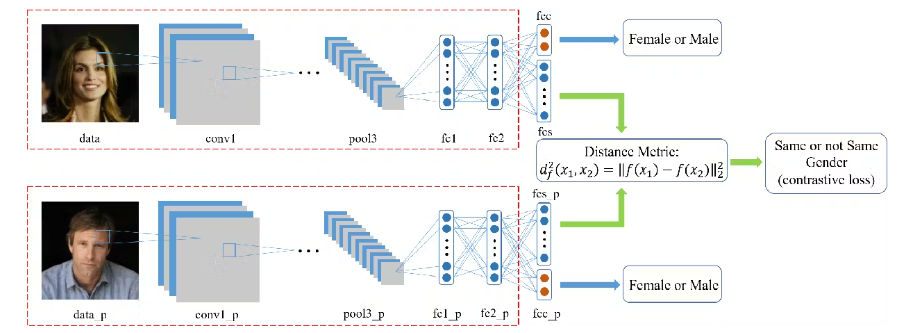
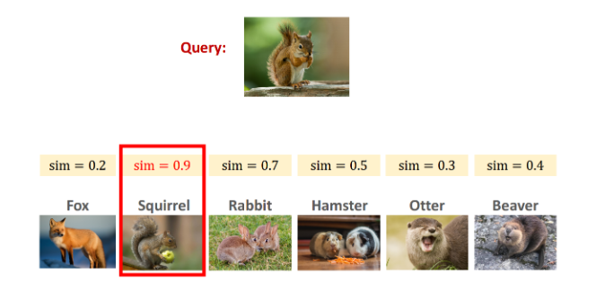
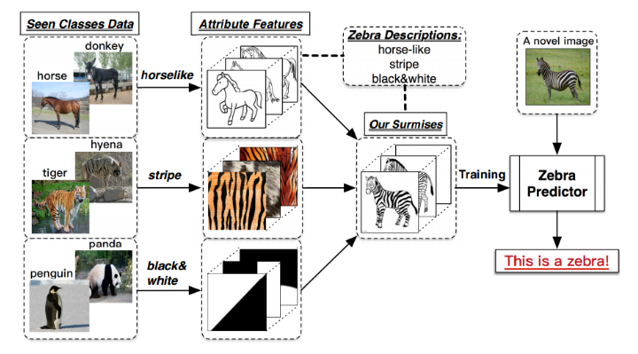

# N-Shot, One-Shot, Few-Shot, Zero-Shot Learning 개념 정리하기

## Shot이란?
문제를 해결하기 위해 모델에 주어진 데이터의 양

## N-Shot learning
- 입력과 출력으로 구성된 학습 셋을 사용하여 모델을 구축하는 것으로 One-Shot, Few-Shot, Zero-Shot으로 분류된다.

## One-Shot Learning

- 두 이미지 사이의 유사점과 차이점을 비교하는 알고리즘
- 모델이 학습하고 의사 결정을 내릴 수 있는 예시가 하나뿐인 경우(예.얼굴인식)

## Few-Shot Learning

- 소수의 레이블이 지정된 학습 데이터로만 학습하는 알고리즘
- 모델을 학습시킬 때 대규모 데이터셋을 확보하기 어려울 때 더 작은 데이터셋으로 학습하는 경우

## Zero-Shot Learning

- 이미 알고 있는 클래스 간에 존재하는 관계에 대한 사전 지식을 사용하여 새로운 클래스에 대한 예측을 내리는 알고리즘
- 새로운 클래스에 사용할 수 있는 라벨링된 데이터가 전혀 없는 경우
