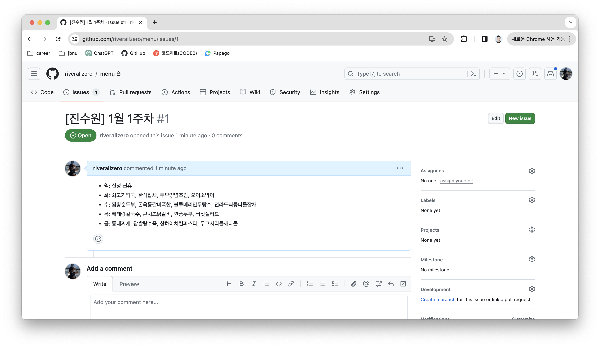

# 코드로 깃허브 이슈 등록하기

먼저 이를 위해서는 토큰을 발급받아야한다. https://github.com/settings/tokens 이 링크에서 모든 엑세스를 허용해준 뒤 토큰을 만들어준다.



```pip install pygithub```

```python
from github import Github

GITHUB_TOKEN = 'github_token'
REPO_NAME = 'github_repository_name'
repo = Github(GITHUB_TOKEN).get_user().get_repo(REPO_NAME)

title = ''
body = ''

repo.create_issue(title=title, body=body)
```
