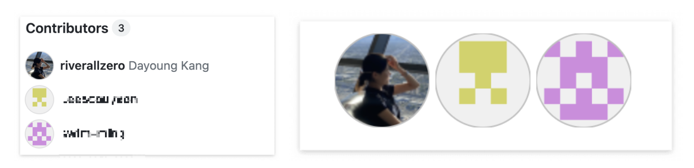

# contributors를 README.md에 뱃지로 표시하기



오른쪽과 같이 저장소에서 기여자들을 확인할 수 있는데, 많은 기여자들을 한꺼번에 README에 표시해 보여주고 싶으면 오른쪽과 같이 뱃지형태로 함께 나타내기도한다.
기여자가 변동될때마다 자동으로 바뀌며 아래 코드를 추가해주면 된다.

```html
<a href="https://github.com/<깃허브_아이디>/<저장소_이름>/graphs/contributors" target="_blank">
  /<저장소_이름>" />
</a>
```
