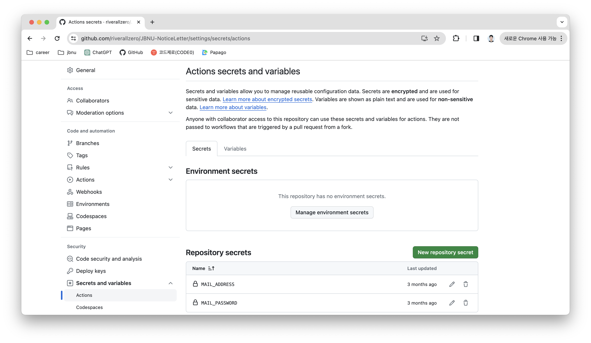

# 코드에 들어가는 비밀번호, 토큰값 숨기기

github action을 이용해 코드를 자동화하는 등 저장소에 코드를 올려 프로그램이 돌아가도록 할 때 비밀번호나 토큰과 같은 값이 올라가야하는 경우가 있다.
하지만 공개되어있는 코드다보니 저장소를 private으로만 올릴 수 있다. 
이때는 깃허브에서 제공하는 secret key를 이용해 저장소에 값을 변수로 설정해놓고 코드에서 변수 이름으로 불러와 사용한다.

```Settings-Security-Screts and variables-Actions```



```New repository secret``` 버튼을 눌러 변수 이름과 값을 설정하면되는데, ```os.environ.get('MAIL_ADDRESS')```이렇게 불러와 사용한다.
