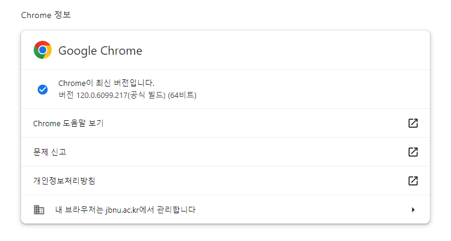

# 셀레니움 설치하기(window, mac)

## window
1. 먼저 [chrome://settings/help](chrome://settings/help)에 접속해 본인의 Chrome 버전을 확인한다.

   

2. https://chromedriver.chromium.org/downloads 에 접속해 위에서 확인한 버전에 알맞는 Chrome driver를 설치한다.
3. 개발하고있는 파이썬 코드와 동일한 폴더에 다운받은 드라이버(chromedriver.exe)를 위치시킨다.

```python
from selenium import webdriver

driver = webdriver.Chrome()
url = 'https://nid.naver.com/nidlogin.login?mode=form&url=https://www.naver.com/'
driver.get(url)
```

## mac
1. ```$ pip install selenium``` 셀레니움 라이브러리를 설치한다.
2. ```$ brew install --cask chromedriver``` brew를 이용해 Chrome driver를 설치한다.
   - Homebrew 설치: ```$ /bin/bash -c "$(curl -fsSL https://raw.githubusercontent.com/Homebrew/install/HEAD/install.sh)"```
3. ```$ mv chromedriver /usr/local/bin``` 설치된 Chrome driver 위치를 변경해준다.

```python
from selenium import webdriver

driver = webdriver.Chrome('/usr/local/bin/chromedriver')
url = 'https://nid.naver.com/nidlogin.login?mode=form&url=https://www.naver.com/'
driver.get(url)
```
