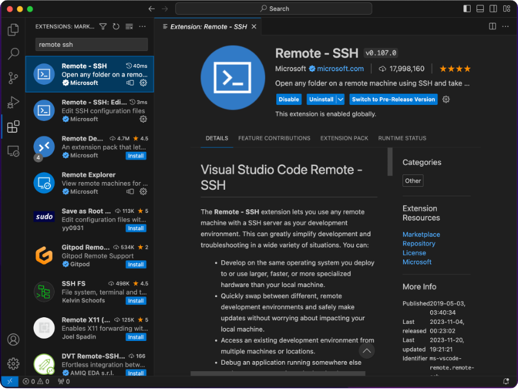
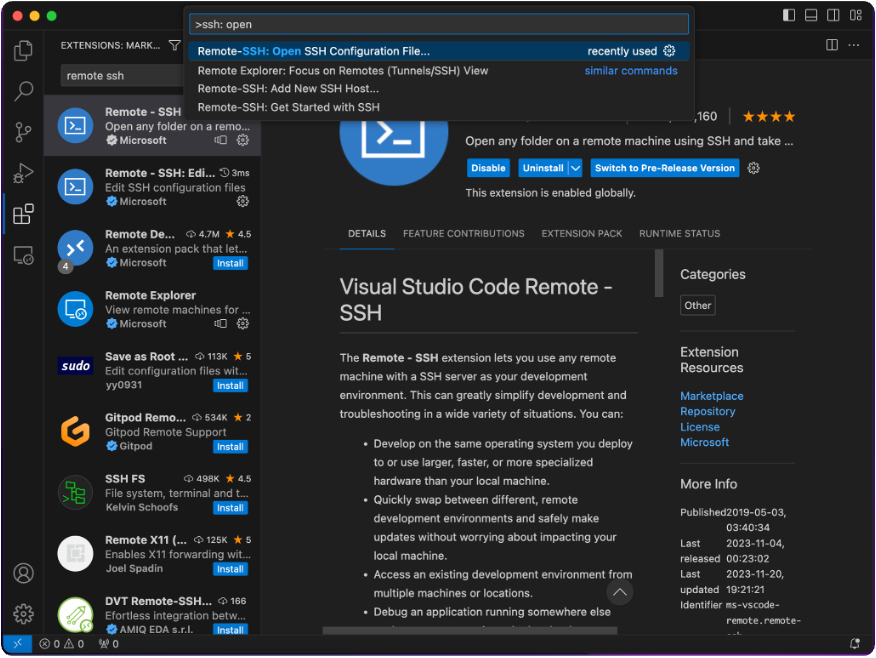
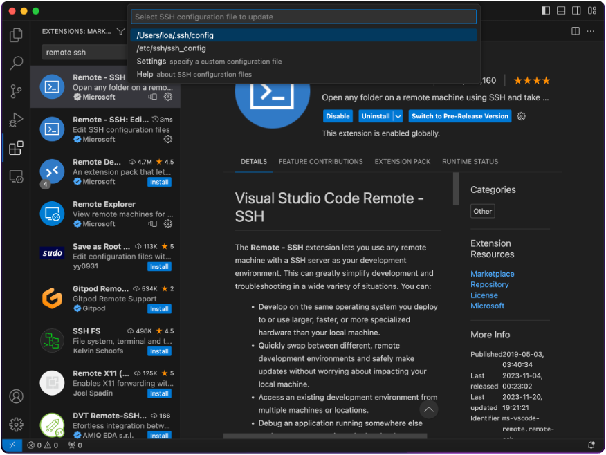
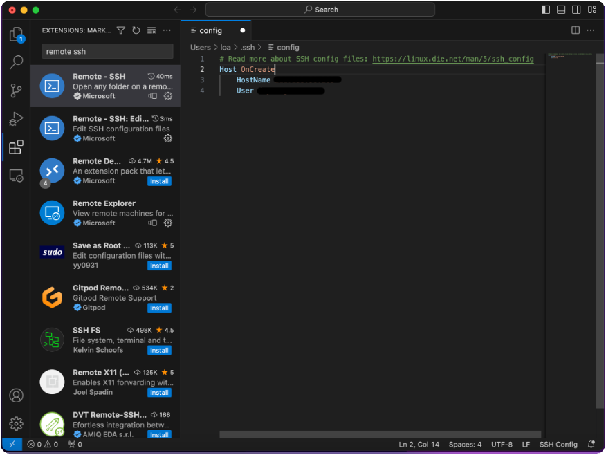
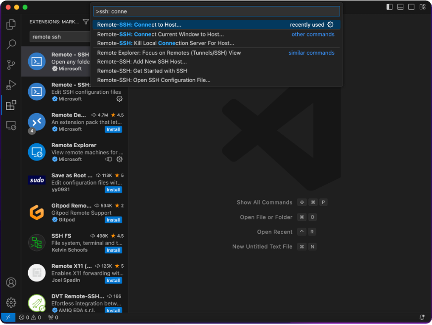
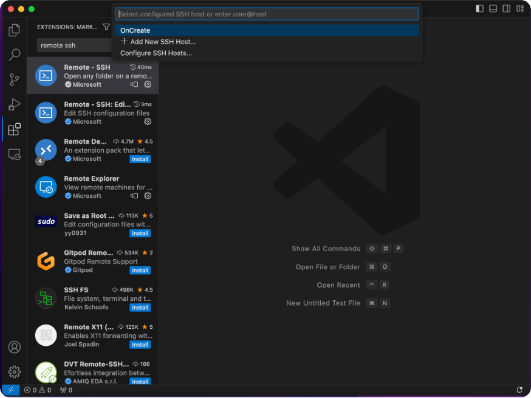

# VS Code에서 서버 접속하기

- 먼저 Extension에서 "Remote-SSH"을 설치해준다.

- SSH config 파일을 열어 선택해준다.

- Host에는 연결 서버 이름을 아무거나 설정해주고, HostName에는 서버 주소를, User에는 서버 유저명을 입력해준다.

- 이제 서버에 연결할 차례이다.

- 해당 서버를 클릭해 비밀번호가 있다면 타이핑 후 연결하면 끝이다.

